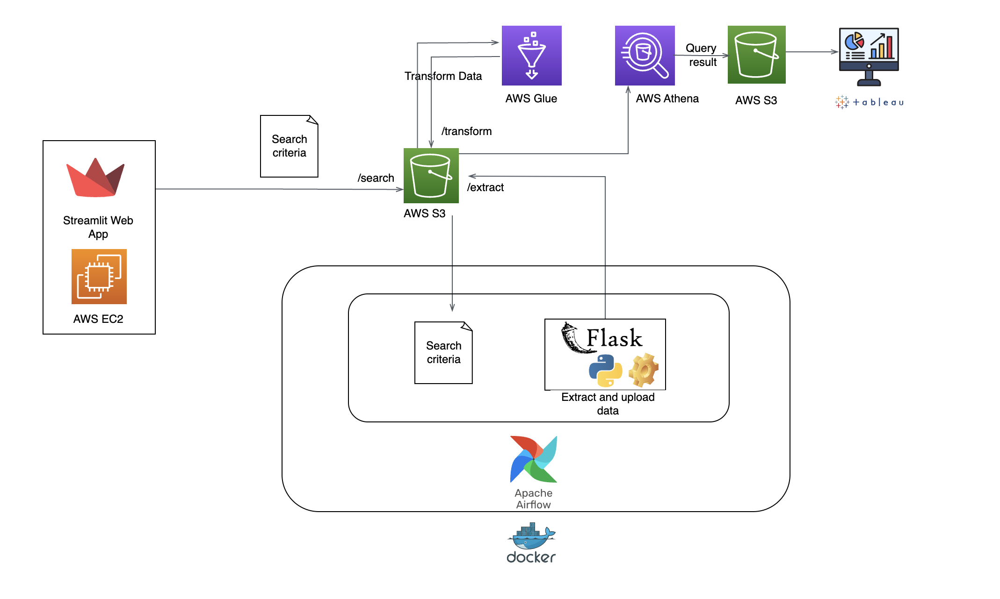
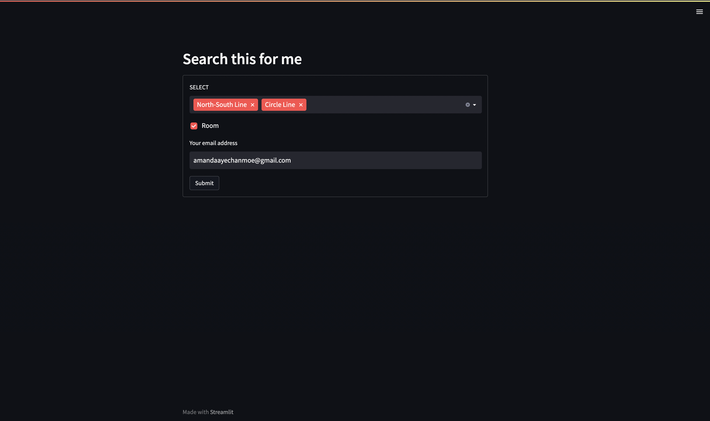

# PropertyFinder (ETL job for porperty data)
> ETL job for property data from https://www.propertyguru.com.sg using python, airflow, AWS S3, AWS Glue, AWS Athena, docker and Tableau.
> Live demo [_here_](https://www.example.com). <!-- If you have the project hosted somewhere, include the link here. -->

## Table of Contents
* [Design](#design)
* [General Info](#general-information)
* [Technologies Used](#technologies-used)
* [Features](#features)
* [Setup](#setup)
* [Usage](#usage)
* [Project Status](#project-status)
* [Room for Improvement](#room-for-improvement)
* [Acknowledgements](#acknowledgements)
* [Contact](#contact)
<!-- * [License](#license) -->

## Design

<!--  -->
<!-- If you have screenshots you'd like to share, include them here. -->

## General Information
- This project intend to help users to automate the searching of property that they are looking for based on the pre-stroed search criteria and get insight of property data.
- In this project Streamlit is used for web application to let users to submit their search criteria such as MRT and property type room or whole unit. Once user has submitted search criterias, those are stored in S3 bucket.

- Airlflow is used to orchestrate the following tasks:
  1. Obtaining the search criteria from S3 bucket.
  2. Calling customized API built with FLASK for web scrapping from https://www.propertyguru.com.sg using selenuim and beautiful soup. 
  3. Upload the extracted data to S3 bucket.
<!-- Airflow Screenshot here -->
- AWS Glue job is used to transform the data written in python. Transfromed data is stored in S3 bucket.
- AWS Athena is used to created database from transformed data S3 bucket and run query driectly on S3 for analysis.
- Query result from AWS Athena is visualized using Tableau.
<!-- Visualize Screenshot here -->
<!-- You don't have to answer all the questions - just the ones relevant to your project. -->

## Technologies Used
- Python - version 3.10.9
- Streamlit - version 2.0
- Flask - version 2.3.2
- Docker - version 3.0
- Airflow - version 2.4.2
- Docker Compose - 20.10.17
- Selenium - version 4.9.1
- beautifulsoup4 - version 4.12.2

## Features
- User uploads search criteria with web app.
- Get insight of property data.

## Setup
What are the project requirements/dependencies? Where are they listed? A requirements.txt or a Pipfile.lock file perhaps? Where is it located?
1. Prerequisite
  1.1 AWS account
  1.2 AWS CLI installed and configured
  1.3 Docker and Docker compose
2. Getting Started
- Provision EC2 with bootstrap script to host streamlit web app (IAM role) aws cli install/configure
- Create s3 bucket with 3 sub folders
- Get docker file and run container for ariflow and flask
- Create AWS gule job
- Run query on Athena to get insight
- Send output result to S3
- Create connection to S3 from tableau to visualize 

4. AWS Infrastructure costs
5. S3 structure
6. Code walkthrough
- Explain the streamlib web app code 
- provide airflow dags and explain what it does for each dags
- Explain flask, python web-crawler code including selenium grip, docker image for selenium girp

Proceed to describe how to install / setup one's local environment / get started with the project.

## Usage
How does one go about using it?
Provide various use cases and code examples here.

`write-your-code-here`

## Project Status
Project is: _in progress_ 

## Room for Improvement
Room for improvement:
- Improvement to be done 1
- Improvement to be done 2

To do:
- Send email alert to user when the property that meets criteria is found.
- Crawl data from additional property listing websites.

## Acknowledgements
Give credit here.
- This project was inspired by...
- This project was based on [this tutorial](https://www.example.com).
- Many thanks to...

## Contact
feel free to contact me! 
- Gmail amandaayechanmoe@gmail.com
- LinkedIn https://www.linkedin.com/in/amanda-aye-chan-moe/

<!-- Optional -->
<!-- ## License -->
<!-- This project is open source and available under the [... License](). -->

<!-- You don't have to include all sections - just the one's relevant to your project -->
